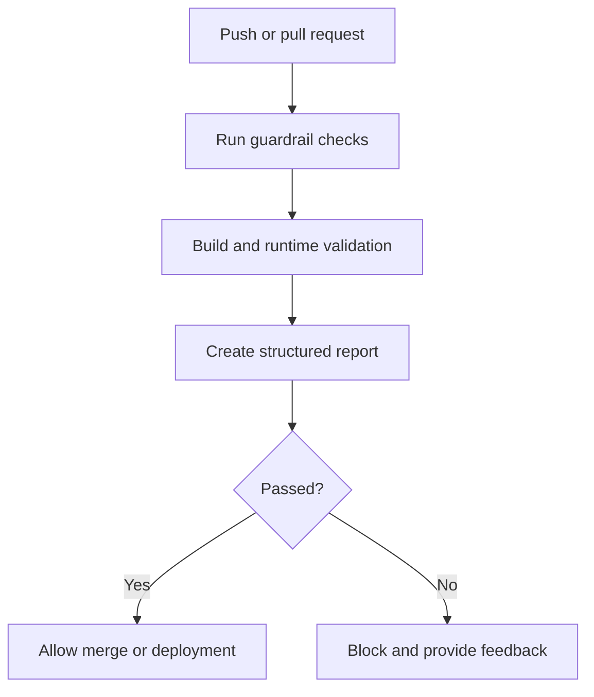
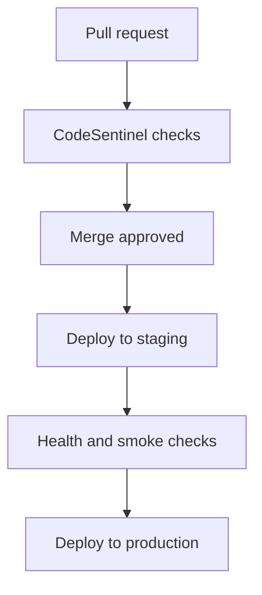

# CodeSentinel

## AI-Aware CI/CD Guardrails

CodeSentinel is a planned developer tool for validating code before it is merged or deployed. It combines deterministic software checks with AI-assisted explanations so developers can understand and fix problems before they reach production.

The project is designed for codebases that may be written or assisted by AI tools. It evaluates the quality, security, behaviour, and deployment readiness of the code rather than trying to determine who or what originally wrote it.

## Current Status

This repository currently contains the architecture and implementation plan for CodeSentinel.

The executable guardrail engine, GitHub Actions integration, and deployment integrations are planned implementation stages. The behaviour described below represents the intended design and does not claim that all components are currently implemented.

## Problem

AI-assisted development can increase delivery speed, but generated or modified code can still contain:

- Failing tests
- Security vulnerabilities
- Missing error handling
- Incorrect dependencies
- Configuration mistakes
- Broken builds
- Runtime failures
- Changes that do not match the intended requirement

CodeSentinel is intended to provide a verification layer between a code change and its merge or deployment.

## Design Principle

> Deterministic checks decide whether code passes. AI explains the result and helps the developer fix it.

AI output should not override a failed test, security check, build, or runtime validation.

## Intended Workflow



1. A developer pushes code or opens a pull request.
2. CodeSentinel runs the configured validation checks.
3. Static analysis, tests, security checks, and build validation are executed.
4. The application can be started in an isolated environment for runtime checks.
5. Results are collected into a structured report.
6. AI explains failures and suggests practical next steps.
7. The result is reported through the pull request or CI/CD system.
8. Critical failures can prevent merging or deployment.

## Planned Guardrails

| Area | Example checks |
|---|---|
| Code quality | Formatting, linting, complexity, duplicate code |
| Correctness | Unit tests, integration tests, type checking |
| Security | Secrets, vulnerable dependencies, unsafe patterns |
| Build validation | Dependency installation, compilation, Docker builds |
| Runtime validation | Application startup, health checks, API smoke tests |
| Deployment readiness | Configuration validation and environment checks |

## Result Classification

Each finding is intended to be classified as:

- **Failure** — The change should not be merged or deployed.
- **Warning** — The change may continue but requires attention.
- **Pass** — The configured checks completed successfully.

Every result should include:

- Overall status
- Check name
- Severity
- File and line reference where available
- Relevant error or log output
- Explanation of the issue
- Suggested remediation

Example:

```text
Deployment blocked

Failed check:
API integration tests

Location:
tests/test_auth.py

Reason:
The authentication endpoint returned HTTP 500 for an invalid token.

Suggested action:
Return a controlled 401 response and add a regression test.
```

## Production Integration

CodeSentinel is intended to operate as a quality gate within an existing CI/CD process.



A production deployment should only be available through an approved pipeline. Production credentials must not be exposed to untrusted validation jobs.

The design can support:

- GitHub Actions
- Docker-based workflows
- Cloud deployment pipelines
- Kubernetes workflows
- Other CI/CD systems through a CLI or API adapter

## Safety Boundaries

CodeSentinel is not intended to:

- Prove that software is completely bug-free
- Replace human code review
- Decide whether code was written by AI
- Allow AI-generated explanations to override failed checks
- Execute untrusted code with production credentials
- Guarantee that every possible runtime or security issue will be detected

Validation should run with isolated execution, restricted permissions, and no access to production secrets.

## Proposed Implementation

The initial implementation can be developed in stages:

### Stage 1: Local validation engine

- Define a common result format
- Run configured tests and static checks
- Collect logs and findings
- Return a reliable pass or fail status

### Stage 2: GitHub Actions integration

- Run checks for pushes and pull requests
- Publish a workflow summary
- Report failures to the developer
- Support a required guardrail status check

### Stage 3: Runtime validation

- Build the application in Docker
- Start it in an isolated environment
- Run health and smoke checks
- Store the validation report as a workflow artifact

### Stage 4: AI-assisted feedback

- Send only relevant failures and changed code to the model
- Explain the cause of the failure
- Prioritise findings
- Suggest remediation
- Keep AI feedback advisory rather than authoritative

### Stage 5: Deployment protection

- Validate staging deployments
- Check application health after deployment
- Require successful checks before production
- Support rollback signals when a deployment becomes unhealthy

## Repository Scope

This repository currently documents the CodeSentinel architecture and implementation direction. Future commits will add the guardrail engine, test integrations, CI/CD workflows, and deployment adapters.

## Success Criteria

CodeSentinel will be considered successful when it can:

1. Detect a reproducible failure in a code change.
2. Prevent the change from passing the configured quality gate.
3. Provide evidence for the failure.
4. Explain the issue clearly.
5. Suggest a practical correction.
6. Re-run the checks after the correction.
7. Allow the change to proceed only when the required checks pass.

## Project Goal

Code should earn its way into production through evidence, testing, and controlled validation rather than assumption.
