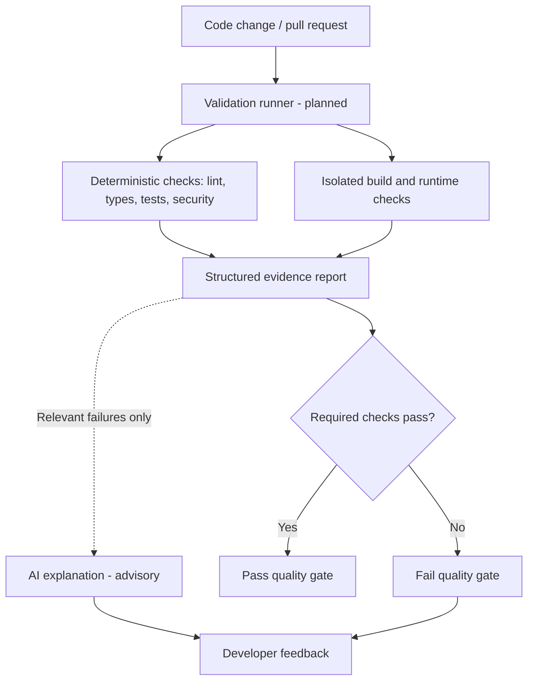

# CodeSentinel

An architecture proposal for an AI-aware CI/CD quality gate: deterministic checks decide whether a change passes; AI-assisted feedback explains the evidence.

> **Status: design-stage project.** This repository contains documentation and a license, not an executable validation engine. CI integration, runtime isolation, reporting, and AI feedback are planned, not shipped features.

## Problem and approach

AI-assisted code still needs tests, security review, build checks, and runtime verification. CodeSentinel proposes a common reporting layer around those checks so developers can understand failures before merge or deployment. It evaluates code, not whether a human or model wrote it.

## Proposed architecture

This diagram describes the intended design, not currently running infrastructure.



AI explanations do not control the pass/fail decision. Passing a gate would indicate only that configured checks passed, not prove complete correctness or security.

## Planned capabilities

| Area | Intended responsibility |
| --- | --- |
| Local validation | Run checks and normalize exit codes, findings, and logs |
| CI integration | Publish a summary and expose a required status check |
| Runtime validation | Build and smoke-test an application in isolation |
| AI feedback | Explain failures without overriding results |
| Deployment protection | Apply staging and health checks before release |

## Repository layout

```text
.
├── README.md                 # Project entry point
├── CodeSentinel_README.md    # Detailed design and implementation stages
└── LICENSE                  # MIT license
```

Read the [detailed design](CodeSentinel_README.md) for result classifications and proposed integration workflows. There are no installation commands, package manifests, tests, or application screenshots to provide yet.

## Implementation roadmap

1. Define the result schema and implement a local runner with reliable exit status.
2. Integrate the runner with GitHub Actions and publish evidence artifacts.
3. Add isolated startup, health, and API smoke checks.
4. Add optional AI explanations with explicit data-sharing controls.
5. Introduce deployment checks and rollback signals.

These are proposed stages, not completed milestones.

## Validation and safety

An initial acceptance case should introduce a reproducible failure, detect it, return a failing status with evidence, and pass only after correction. No such test run is included yet.

Untrusted changes must not execute with production secrets or deployment permissions. Runtime isolation and restricted credentials are requirements still needing implementation and verification. Human review remains necessary.

## License

[MIT](LICENSE).
